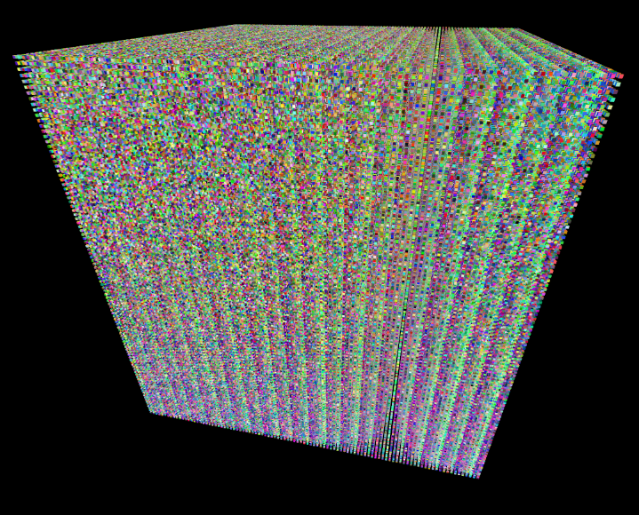

# Projet jeu de la vie en 3D

[@awoimbee](https://github.com/awoimbee) / [@Ouilliam](https://github.com/Ouilliam)

No pygames, no numpy, no nonsense, just tkinter !

An old project we did for our baccalauréat (high-school diploma/degree).
Most of the comments in the code are in french, and it's not the best project ever.
But its a nice cellular automata & 3D engine in pure vanilla python.

## Some old screenshots

- The program:  
    
    
- Some patterns:  
    
    
- 3D rendering stuff:  
    
    
    
